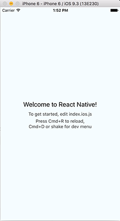

# 1.0 Introduction

#### Who is this material for?
This material is for those who are familiar with React and are willing to dive
into developing mobile apps with **React Native**.
For this course we assume that our audience also has solid knowledge of
JavaScript and some familiarity with ES6 syntax and CSS.

#### What is React Native?
React Native is a **framework** for building **mobile** applications with
**JavaScript** and **React** by leveraging **native components**.
As we already know in React we have a virtual DOM which reflects the real DOM.
Each React Element corresponds to a node in the Virtual DOM and when an element
changes, that change is being reflected onto the real DOM. In React Native
we don't deal with the DOM but with the Native Components which are provided by
a specific platform. Instead of dealing with WebViews we will be using actual
platform-specific native components. That means that when writing our components
with **JSX** instead of using `<div>` to create a components or groupings of
multiple components, we would use the native `<View>` component.
Similarly we will use `<Text>` instead of `<span>`.
Later in this course we will introduce other, more complex, native
components and some platform specific components which look and behave
differently on each platform.
React Native embraces the **Learn Once And Apply Everywhere** paradigm, which is
quite different from **Write Once Use Everywhere**. This is because there are
some major differences between every mobile platform, and it is impossible
to cover all of those differences with the same codebase. With React Native we
can use the same knowledge and tools to build separate apps for Android and iOS,
and if we are pedantic enough we can reuse most of the code which deals with
the business logic the apps.

#### How does it work?
  - where is the JavaScript code executed
  - what is being compiled?

## 1.1 Getting Started
You can find the most up to date information about how to get started
[here](https://facebook.github.io/react-native/docs/getting-started.html#content).

#### Update and upgrade `brew` for OS X
Since `brew` will be used to install all the needed tools, you should update it
to ensure that you will get the most recent versions of all the required
programs:
```sh
$ brew update && brew upgrade
```

#### Install Node and NPM
Using `brew`:
```sh
$ brew install node
```
Alternatively you can download node [here](https://nodejs.org/en/download/)
and manually install it.

#### Install `watchman`
This tool will be used by React Native to detect changes of your code and auto
reload your application.
```sh
$ brew install watchman
```

#### (Optional) Install `flow`

> [Flow](http://flowtype.org/) is a static type checker, designed to quickly
find errors in JavaScript applications

We will not be using this here, however you can download it if you want to
used it later on.
```sh
$ brew install flow
```

#### Install the **React Native** CLI tools:
```sh
$ npm install -g react-native-cli
```
Or, if you have *permission error* then use `sudo`:
```sh
$ sudo npm install -g react-native-cli
```

### Setup the environments
For **iOS** install **Xcode** from the App Store.
For **Android** follow these instructions [here](https://facebook.github.io/react-native/docs/android-setup.html).

#### Initiate a **React Native** project:
```sh
$ react-native init HelloWorld
```

### Run your `HelloWorld` app
After executing `react-native init HelloWorld` the output in the terminal is
extremely useful and it explains how to run your project:
```sh
To run your app on iOS:
   cd /Users/rangle/HelloWorld
   react-native run-ios
   - or -
   Open /Users/rangle/HelloWorld/ios/HelloWorld.xcodeproj in Xcode
   Hit the Run button
To run your app on Android:
   Have an Android emulator running (quickest way to get started), or a device connected
   cd /Users/rangle/HelloWorld
   react-native run-android
```

If running
```sh
$ react-native run-ios
```
throws the following error:
```
Command `run-ios` unrecognized. Did you mean to run this inside a react-native project?
```
then you might need to upgrade your `react-native` in the following way:
```sh
$ npm install --save react-native@latest
```
The result of running the `HelloWorld` app in the iOS simulator looks like this:



## 1.2 Hello World
Open one of the two files: `index.android.js` or `index.ios.js` depending on
which platform you want to run this `HelloWorld` app. This starter project was
created as a result to running the `react-native init HelloWorld` command and
let's look at the code that was generated:

```JavaScript
/**
 * Sample React Native App
 * https://github.com/facebook/react-native
 */

import React, {
  AppRegistry,
  Component,
  StyleSheet,
  Text,
  View
} from 'react-native';

class HelloWorld extends Component {
  render() {
    return (
      <View style={styles.container}>
        <Text style={styles.welcome}>
          Welcome to React Native!
        </Text>
        <Text style={styles.instructions}>
          To get started, edit index.android.js
        </Text>
        <Text style={styles.instructions}>
          Shake or press menu button for dev menu
        </Text>
      </View>
    );
  }
}

const styles = StyleSheet.create({
  container: {
    flex: 1,
    justifyContent: 'center',
    alignItems: 'center',
    backgroundColor: '#F5FCFF',
  },
  welcome: {
    fontSize: 20,
    textAlign: 'center',
    margin: 10,
  },
  instructions: {
    textAlign: 'center',
    color: '#333333',
    marginBottom: 5,
  },
});

AppRegistry.registerComponent('HelloWorld', () => HelloWorld);
```

The very first thing that we have is importing the following objects from the
`react-native` package:
- React,
- [AppRegistry](https://facebook.github.io/react-native/docs/appregistry.html),
- Component,
- StyleSheet,
- Text,
- View

`React` is the library used for creating UI components. We needed to import it
in every file where **JSX** is used for defining the UI components.
`Component` is a class which we'll be extending to create our custom components.
`AppRegistry` is the JS entry point to running all React Native apps.
`StyleSheet` is an abstraction similar to CSS StyleSheets.
`View` and `Text` are native components.

```
View
The most fundamental component for building UI, View is a container that
supports layout with flexbox, style, some touch handling, and accessibility
controls, and is designed to be nested inside other views and to have 0 to many
children of any type. View maps directly to the native view equivalent on
whatever platform React is running on, whether that is a UIView, <div>,
android.view, etc. ...
```

```
Text
A React component for displaying text which supports nesting, styling, and touch
handling. ...
```

Let's get into more details and try to understand the rest of this code.
The following line is creating the `HelloWorld` component:
```JavaScript
class HelloWorld extends Component {
...
```

Then inside the `render()` method it's return the content of the `HelloWorld`
component, which is three `<Text>` components wrapped in a `<View>` component.

After that we have `styles` which is a `StyleSheet` reference from an
object that is passed in the `create()` method.

```JavaScript
...
const styles = StyleSheet.create(styleObj);
...
```

> static create(obj: {[key: string]: any})

> Creates a StyleSheet style reference from the given object.

The last line is specifying which is the App (root) component and that is done
by using the `AppRegistry.registerComponent` method:

```JavaScript
...
AppRegistry.registerComponent('HelloWorld', () => HelloWorld);
...
```
Since in this simple sample app there's only the `HelloWorld` component, that
is being used to register as the App component.

Let's play with this file and change the text inside the main view:
```JavaScript
...
class HelloWorld extends Component {
  render() {
    return (
      <View style={styles.container}>
        <Text style={styles.welcome}>
          Hello World!
        </Text>
        <Text style={styles.message}>
          Have a great day!
        </Text>
      </View>
    );
  }
}
...
```
We changed the code so that now we have 2 placeholders for the welcome text and
a message text.

Also let's change the background color of the container to `#333333` and the
color of the message to white.

```JavaScript
...
const styles = StyleSheet.create({
  container: {
    flex: 1,
    justifyContent: 'center',
    alignItems: 'center',
    backgroundColor: '#333333',
  },
  welcome: {
    fontSize: 20,
    textAlign: 'center',
    margin: 10,
  },
  message: {
    textAlign: 'center',
    color: 'white',
    marginBottom: 5,
  },
});
```

Usually we would want to componentize our apps further by creating our custom
components which properties can be controlled from its parent component.
Let's go ahead and create a `Message` component which will be accepting 2
properties: **1. the text content and** and **2. the color of the message**.

Let's create a file `Message.js` and write the code for the `Message`
component:

**Message.js**
```JavaScript
import React, {
  Component,
  StyleSheet,
  Text,
} from 'react-native';

class Message extends Component {
  static propTypes = {
    message: React.PropTypes.string,
    color: React.PropTypes.string,
  };

  render() {
    const styles = StyleSheet.create({
      message: {
        textAlign: 'center',
        marginBottom: 5,
        color: this.props.color,
      },
    });

    return (
      <Text style={ styles.message}>
        { this.props.text }
      </Text>
    );
  }
}

export default Message;
```

Now we can use the `Message` component in our app:

**index.android.js**
```JavaScript
import React, {
  AppRegistry,
  Component,
  StyleSheet,
  Text,
  View
} from 'react-native';
import Message from './Message.js';

class HelloWorld extends Component {
  render() {
    return (
      <View style={styles.container}>
        <Text style={styles.welcome}>
          Hello World!
        </Text>
        <Message
          text={ 'Have a great day!' }
          color={ 'yellow' }
        />
      </View>
    );
  }
}
...
```

Now let's run our modified app, make sure you are inside the `./HelloWorld`
directory:
```
$ react-native run-android
```
The output looks like this:


#### Debugging
For debugging will use Chrome Dev Tool.
Let's add a `dubugger` in the `render()` method of our `Message` component:
```JavaScript
...
render() {
  const styles = StyleSheet.create({
    message: {
      textAlign: 'center',
      marginBottom: 5,
      color: this.props.color,
    },
  });
  debugger;
  return (
    <Text style={ styles.message}>
      { this.props.text }
    </Text>
  );
}
...
```

Now to open the **Chrome Dev Tool** you can do that by pressing the keys
`Command + Control + Z` if using **iOS simulator** or clicking on the
 button
from the **Genymotion Android** simulator.

**iPhone simulator**


**Android simulator**


From the menu choose the **Debug in Crome** option, which will open Chrome
with a Dev Tools:


This means that you can use Chrome debugger in the same way you do for debugging
web applications.
